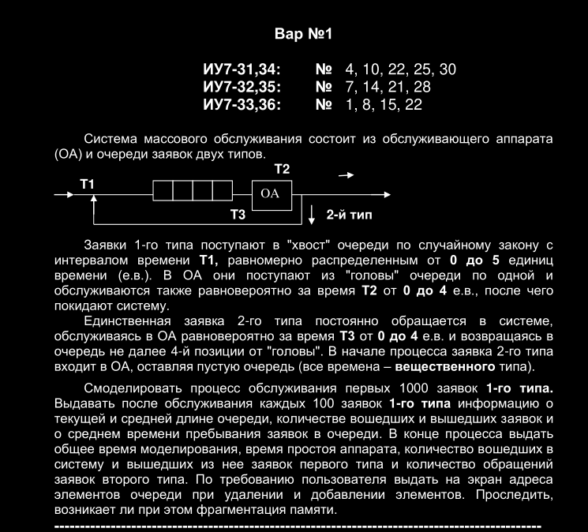

# 1 Вариант

### Features

- Очередь полиморфна и не привязана к task_t, можно использовать с 
  любыми типами фиксированного размера
- Возврат значений происходит в буфер result, передаваемый в функцию.
 Malloc можно не использовать
- Нода связного списка владеет (cons_t) значением, которое хранит. Значение хранится рядом с нодой.
- Добавление и удаление за O(1)
- Добавление в любое место (не совсем очередь? задание такое...)
- Задание декомпозировано в объекты 
